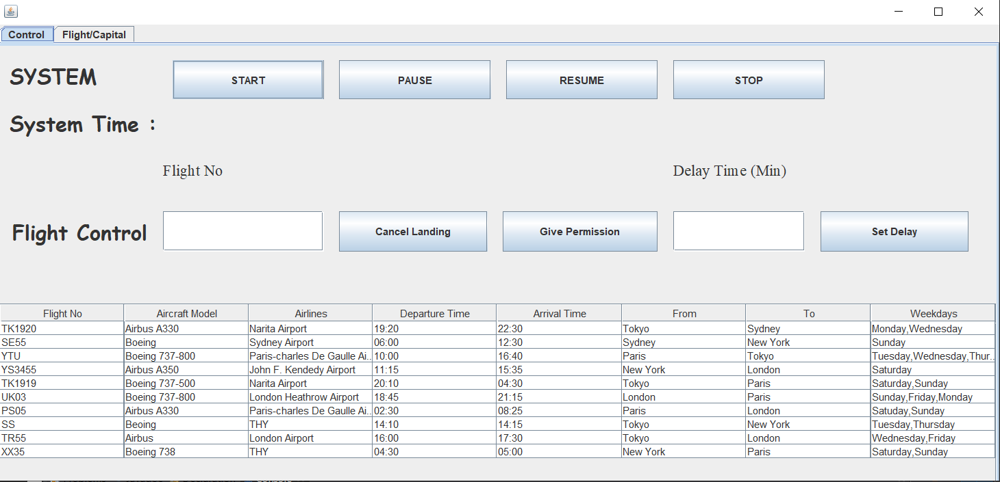
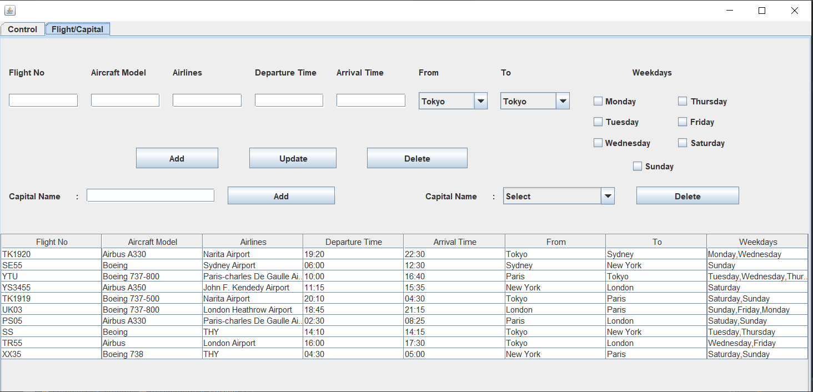
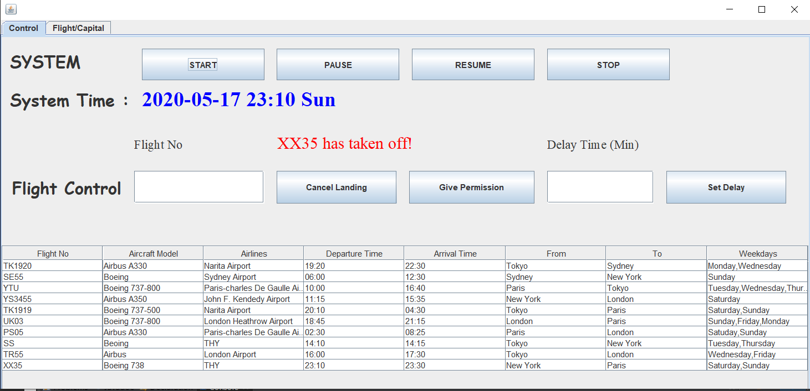
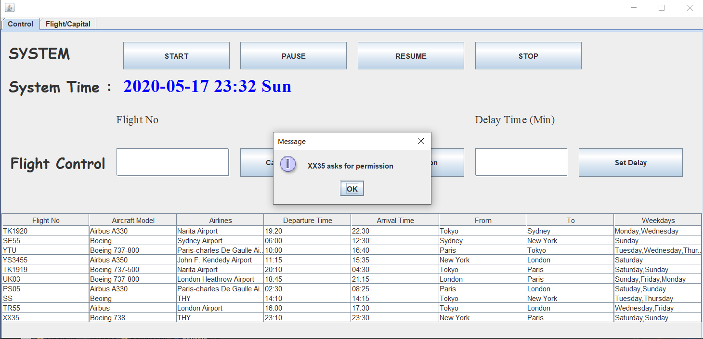

# FlightTrackSystem

It is a Flight Track System Application that is written in Java.

## What Did I Use ?
- I used java langugage because it is simple than other languages in order to build a desktop application.
- I used swing framework and Netbeans because it is swing has so many tools to build an dekstop application. Also, Netbeans IDE is so appropirate to use swing.
- I built the program with multithread because every flight has date for departure and arrival. So every flight is a thread for check the time.

## System Defaults
- The system has a timer. Every second in the real life equals one minute in the program
- There are 10 flights and 5 capitals.
- Flight Table

## Properties 
- The system has a timer. Every second in the real life equals one minute in the program
- There are buttons to start, stop, pause, and resume the system.
- There are buttons to add/delete a capital.
- There are buttons to add/update/delete a flight.
- There are buttons to cancel landing or give permission for the landing.
- There is button to set delay (min) to a flight.

## Screenshots
 
 
 
 
